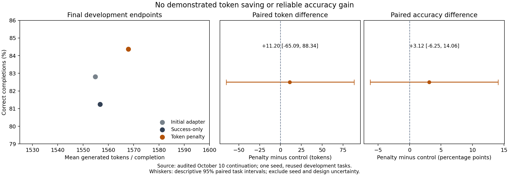
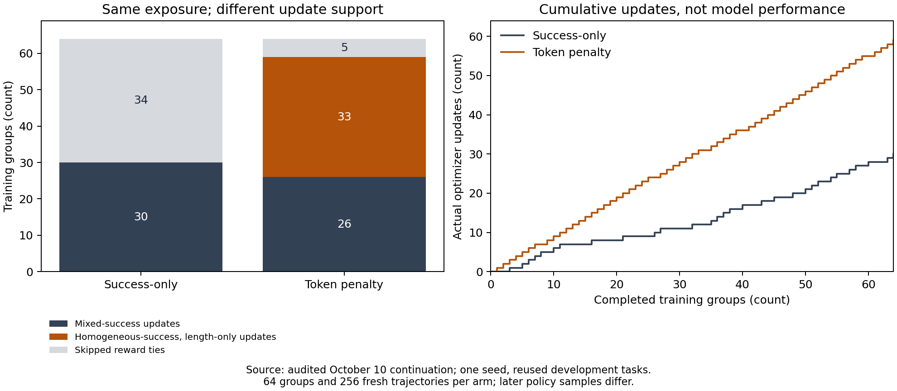
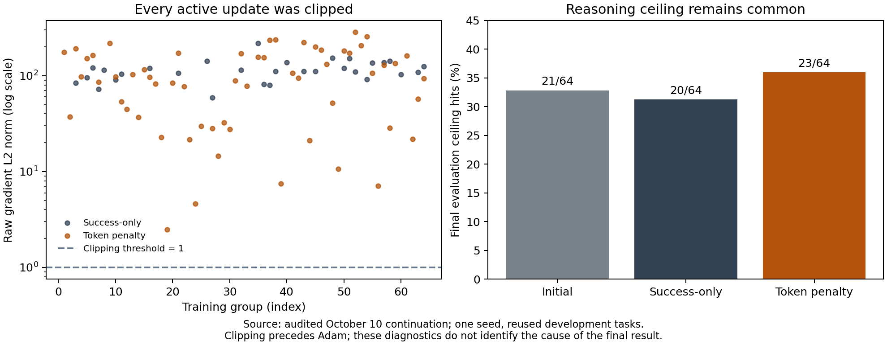

# Reward support without demonstrated token savings

October 10, 2026. **Retrospective analysis of the completed exploratory study.** The endpoint, frozen scientific settings and original audits remain unchanged. No model was loaded and no new samples, checkpoint evaluations or GPU jobs were produced. Every used input is verified against the published evidence manifest.

## What changed in the estimator

Both arms receive 64 groups of four trajectories. Success-only has 30 mixed-success groups and 34 homogeneous-success groups; only the mixed groups update. The penalty has 26 mixed groups and 38 homogeneous-success groups. Thirty-three homogeneous groups contain four correct answers with differing lengths and update under the cost penalty. One all-correct group and four all-incorrect groups have tied costs and skip. Thus the penalty makes 59 updates and the control 30.

For group size G, the leave-one-out advantage is `A_i = G/(G-1) * (R_i - mean(R))`. It sums to zero, and its mean square is `(G/(G-1))^2` times within-group reward variance (divisor G). With `R=S-lambda*C`, that variance expands to `Var_G(S) - 2*lambda*Cov_G(S,C) + lambda^2*Var_G(C)`. When success is homogeneous, only the cost term remains. Different lengths therefore create advantage support, even when every answer is correct. Nonzero advantages alone do not guarantee a nonzero aggregate gradient or useful behavior.

On the control's recorded rows, algebraically replacing its reward with `S-C/1024` gives nonzero advantages in 61 groups. This is same-row rescoring, not a counterfactual trained policy. Later trajectories are different across arms; the net 29-update difference cannot be called 29 identical groups rescued by the penalty.

### Identical initial samples

The first group, `v3-t3-train-00367`, has identical task, seeds, answer choices, scratch token IDs and sampled likelihoods across arms. All answers are correct and costs are 1196, 1036, 2049 and 2049 tokens. The mean is 1582.5. Control advantages are all zero. Penalty advantages are `(1582.5-C_i)/768`, or approximately **0.503255, 0.711589, -0.607422, -0.607422**. The shorter successful traces are favored in the recorded estimator. This is an observed initial estimator mechanism, not proof of eventual token savings.

## Clipping and ceilings

Every active update is clipped at raw gradient norm 1: 30/30 control updates and 59/59 penalty updates. Control raw norms range from 58.95 to 216.69, median 111.31; penalty norms range from 2.49 to 284.80, median 97.00. The trainer logs the pre-clipping norm. Median raw gradient multipliers are approximately 0.00898 and 0.01031. These are not ratios of final Adam parameter steps. Adam moments, prior history, bias correction and epsilon prevent interpreting them as a simple learning-rate reduction. No unclipped ablation was run, and clipping is not established as the cause of the null endpoint.

Training reasoning-ceiling hits are 95/256 control and 100/256 penalty. Final evaluation hits are 20/64 and 23/64. Ceilings truncate the recorded reasoning policy; they do not demonstrate that a higher ceiling would improve correctness or efficiency. The present data cannot establish what those completions would have done beyond the ceiling.

## Final result and example selection

The penalty is correct on 54/64 completions versus 52/64 control, and uses 1567.890625 versus 1556.6875 mean tokens. The primary cost difference is +11.203125 tokens, descriptive 95% interval [-65.09375, 88.34375]. Accuracy differs by +3.125 percentage points, interval [-6.25, 14.0625]. Neither interval excludes zero. The intervals omit training-seed and design-selection uncertainty.

The 64 matched outcome cells contain 47 both-correct, seven penalty-only-correct, five control-only-correct and five both-incorrect records. We select the lexicographically first `(task_id, sample, seed)` in each nonempty cell, without ranking length changes or prose. These are retrospective illustrations, not representative samples of effect size:

| Cell: control, penalty | Task suffix / sample | Control tokens | Penalty tokens |
| --- | --- | ---: | ---: |
| Incorrect, incorrect | 00010 / 1 | 2049 | 2049 |
| Incorrect, correct | 00004 / 0 | 2049 | 2049 |
| Correct, incorrect | 00001 / 0 | 1704 | 2049 |
| Correct, correct | 00000 / 0 | 1094 | 2049 |

All task IDs begin `v3-t3-dev-`. The selected penalty traces all hit the ceiling; that fact is particular to the selection rule and does not replace the complete ceiling rate. [The companion](index.html) exposes candidate expressions, visible examples and full recorded traces.

## Figures and reproduction

The JSON output is [reward-continuation-analysis.json](reward-continuation-analysis.json). Standalone SVG and PNG figures and the HTML companion are published alongside the [manuscript source](PAPER_DRAFT.tex) and [PDF](PAPER_DRAFT.pdf). The figures contain audited measured data. Rebuilding the analysis from raw records requires the complete frozen source and evidence bundle, which remains private. No new model runs were performed for this retrospective analysis.

## Interpretation and next hypothesis

The strongest supported mechanism is reward-dependent update support: a length penalty creates advantages in homogeneous-success groups. The endpoint shows no demonstrated token saving at this horizon. Persistent ceilings and universal clipping are descriptive diagnostics; they motivate hypotheses rather than resolve attribution. One seed, inspected development data and the reused control's different deterministic runtime remain material limitations.

The next proposed question is whether homogeneous-success cost advantages contribute to a reproducible token response under matched fresh controls. The prospective mechanism protocol (not executed) is a distinct unexecuted proposal, not an extension of this run or permission to spend. It is preferable to an open-ended search for a positive result.

Relevant prior work: [Ahmadian et al., REINFORCE-style optimization for language models](https://arxiv.org/abs/2402.14740) and [Liu et al., DLER](https://arxiv.org/abs/2510.15110). Their settings differ; this report does not reproduce their performance claims or establish an exclusive cause for our result.

## Public evidence scope

This companion publishes derived diagnostics, recorded synthetic examples, measured figures and manuscript source. The complete audit archive and frozen implementation remain in the private research repository. These files do not constitute the complete raw reproduction bundle. No future sealed-test tasks are included. Original text, measurements and figures are CC BY 4.0; linked third-party work retains its own terms.
